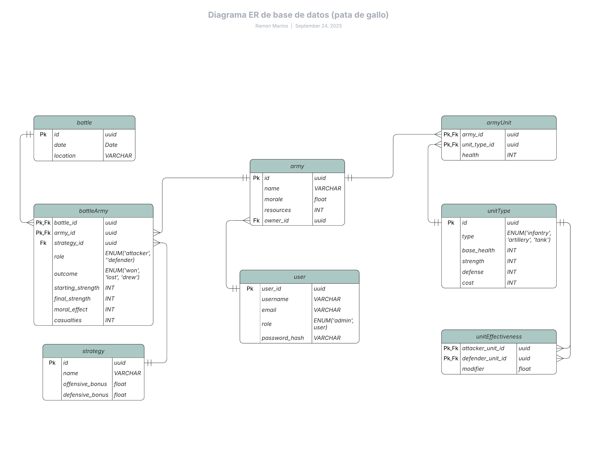

# WarSim

## Table of contents

- [**Overview**](#overview)

## Overview

This API is part of the LABA internship from Solvd.

**WarSim** is a battle simulation game where players can build armies and clash in combat.
Players command armies composed of soldiers and weaponry, each with unique attributes and capabilities.

The simulation determines the outcome of battles based on:

- Troop Strength – The number of soldiers and their combat experience.
- Weapon Effectiveness – Damage, range, and special properties of the arsenal.
- Strategic Decisions – Formations, tactics, and adaptive maneuvers during battle.

This API provides all the endpoints necessary to manage, control, and analyze large-scale virtual warfare, such as:

- Create and manage armies, soldiers, and weaponry.
- Configure combat parameters and strategies.
- Simulate battles and retrieve detailed results.

ERD Diagram:



# Docker Setup

This project uses **Docker** and **Docker Compose** to run both the PostgreSQL database, Redis and the Node.js application.

## 1. Prerequisites

Make sure the following are installed on your system:

- [Docker](https://www.docker.com/get-started)
- [Docker Compose](https://docs.docker.com/compose/install/)

---

## 2. Environment Variables

The application requires certain environment variables to run. These are set directly in `docker-compose.yml`:

```yaml
# Database service
POSTGRES_USER: warsimuser
POSTGRES_PASSWORD: mypassword
POSTGRES_DB: warsimapp

# App service
DB_USER: warsimuser
DB_PASSWORD: mypassword
DB_NAME: warsimapp
DB_HOST: db
DB_PORT: 5432
ADMIN_EMAIL: admin@war-simulation.com
ADMIN_PASSWORD: adminpassword
```
You should change the credentials for security, always keeping `USER`, `PASSWORD`, `DB NAME` the same across both services.

## 3. Build and Start Containers

From the project root, run:

```bash
docker-compose up --build
```

This command will:

&nbsp;&nbsp;&nbsp;**1.** Pull required images (node:22-slim for the app, postgres:16 for the database).

&nbsp;&nbsp;&nbsp;**2.** Build your Node.js application container.

&nbsp;&nbsp;&nbsp;**3.** Start both the db and app services.

&nbsp;&nbsp;&nbsp;**4.** Wait for the database to pass the healthcheck before starting the app.

## 4. Stop Containers

To stop and remove the running containers while keeping database data:

```bash
docker-compose down
```

The PostgreSQL data is persisted in the db_data volume, so it is safe to restart.

## 5. Rebuild Without Cache

If you need to rebuild the images from scratch:

```bash
docker-compose build --no-cache
docker-compose up
```

## 6. Notes & Tips

- The database initialization script init.sql is automatically executed on first container startup.
- The app requires ADMIN_EMAIL and ADMIN_PASSWORD to create the first admin user.
- The db service includes a healthcheck to ensure the database is ready before the app starts.
- Docker volumes:
&nbsp;&nbsp;&nbsp;db_data → persists PostgreSQL data between container restarts.
