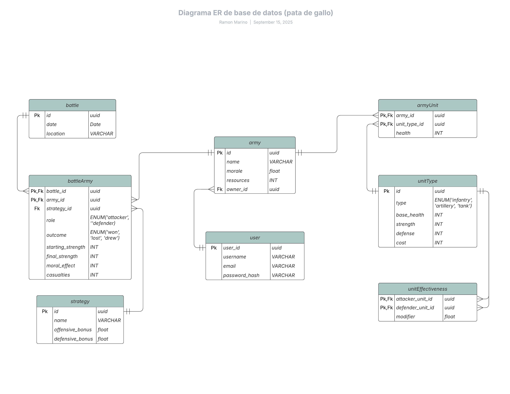

# WarSim

## Table of contents

- [**Overview**](#overview)

## Overview

This API is part of the LABA internship from Solvd.

**WarSim** is a battle simulation game where players can build armies and clash in combat.
Players command armies composed of soldiers and weaponry, each with unique attributes and capabilities.

The simulation determines the outcome of battles based on:

- Troop Strength – The number of soldiers and their combat experience.
- Weapon Effectiveness – Damage, range, and special properties of the arsenal.
- Strategic Decisions – Formations, tactics, and adaptive maneuvers during battle.

This API provides all the endpoints necessary to manage, control, and analyze large-scale virtual warfare, such as:

- Create and manage armies, soldiers, and weaponry.
- Configure combat parameters and strategies.
- Simulate battles and retrieve detailed results.

ERD Diagram:

